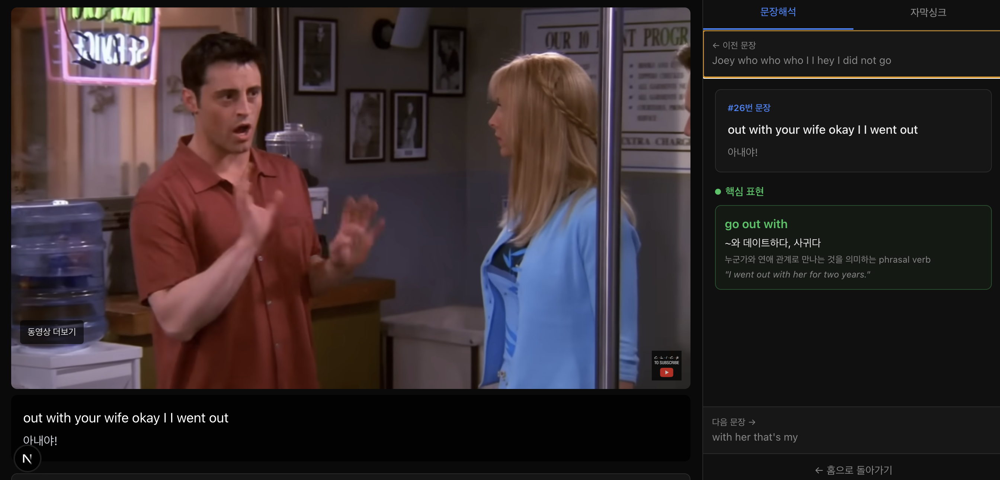

# Shadowing YouTube

YouTube 영상의 자막을 활용하여 문장 단위로 영어를 학습할 수 있는 웹 애플리케이션.
번역과 표현 분석은 Claude CLI로 로컬에서 처리합니다 (별도 API 키 불필요).

## 요구사항

- Node.js 18 이상
- [Claude Code CLI](https://docs.anthropic.com/en/docs/claude-code) 설치 필요 (`claude` 명령어)

## 설치 및 실행

```bash
# 1. 의존성 설치
npm install

# 2. 개발 서버 실행
npm run dev
```

브라우저에서 http://localhost:3000 으로 접속합니다.

## 사용 방법

### Step 1 - 자막 추출
웹 페이지에서 YouTube 링크를 붙여넣고 **자막 추출** 버튼을 클릭합니다.

### Step 2 - Claude로 번역
자막 추출이 완료되면 화면에 표시되는 명령어를 터미널에서 실행합니다:

```bash
npm run translate <youtubeId>
```

이 명령어는 Claude CLI(`claude -p`)를 사용하여:
1. 영어 자막을 한국어로 번역 → `_script_translate.txt`
2. 핵심 표현 및 관용 표현 분석 → `_script_analysis.json`

을 수행하고 결과를 `data/videos/{youtubeId}/` 디렉토리에 저장합니다.
자막을 4개 청크로 분할하여 번역과 분석을 **최대 8개 프로세스로 병렬 처리**합니다.
이미 파일이 존재하면 건너뜁니다. 재생성하려면 해당 파일을 삭제 후 다시 실행하세요.

### Step 3 - 학습
번역이 완료되면 웹 페이지에서 **학습 시작하기** 버튼을 눌러 학습을 시작합니다.

### 키보드 단축키

| 키 | 동작 |
|----|------|
| `1` | 이전 문장 |
| `2` | 재생 / 일시정지 |
| `3` | 현재 문장 반복 |
| `4` | 다음 문장 |

### 자막 싱크 조절

하단 컨트롤 바에서 싱크 오프셋을 조절할 수 있습니다:
- `-` : 자막 0.5초 앞으로 (자막이 영상보다 느릴 때)
- `+` : 자막 0.5초 뒤로 (자막이 영상보다 빠를 때)
- 가운데 값 클릭 : 0.0s로 초기화

## 데이터 구조

영상별로 `data/videos/{youtubeId}/` 디렉토리에 3개 파일이 생성됩니다:

| 파일 | 설명 | 생성 시점 |
|------|------|----------|
| `{id}_script.txt` | 타임스탬프(밀리초) + 영어 원문 | 웹에서 자막 추출 시 |
| `{id}_script_translate.txt` | 한국어 번역 | `npm run translate` 실행 시 (Claude CLI) |
| `{id}_script_analysis.json` | 핵심/관용 표현 분석 | `npm run translate` 실행 시 (Claude CLI) |

## 기술 스택

- Next.js 16 (App Router) + TypeScript
- Tailwind CSS v4
- Zustand (상태 관리)
- YouTube IFrame Player API
- youtube-transcript-plus (자막 추출)
- Claude Code CLI (번역 및 표현 분석)


## 화면


